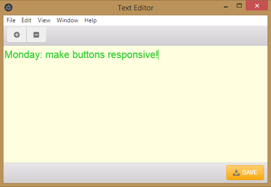

# Text Editor

An Electron cross-platform Desktop app, in which you can write your notes, enlarge or minimize text font and save your notes to files on your computer.

### Build with

This Desktop app is based on Electron, JavaScript, Photon UI, HTML5 and CSS3.

### Dev Dependencies

(to be added)

### Setup

(to be added)

### Prerequisites

(to be added)
